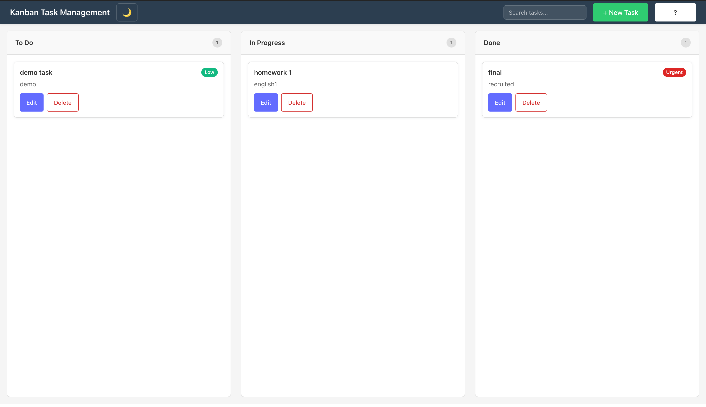

# Kanban Task Management

[](https://github.com/shazamcodes64/gdg-srm-kanban/actions/workflows/ci.yml)
[](https://opensource.org/licenses/MIT)

A modern, responsive kanban board application for organizing tasks across three workflow stages: To Do, In Progress, and Done. Built with React, TypeScript, and drag-and-drop functionality for intuitive task management.

## 📸 Screenshots

<div align="center">
  
  <p><em>AI-powered Kanban board with smart task prioritization and drag-and-drop functionality</em></p>
</div>

## ✨ Highlights

- 🤖 **AI-Powered Priority Prediction** - Smart task prioritization using machine learning
- 🎯 **Drag-and-Drop Interface** - Intuitive task management with smooth animations
- 💾 **Auto-Save** - Never lose your work with automatic LocalStorage persistence
- 📱 **Fully Responsive** - Works seamlessly on desktop, tablet, and mobile
- ♿ **Accessible** - WCAG compliant with keyboard navigation and screen reader support
- ⚡ **Fast & Lightweight** - Built with Vite for optimal performance
- 🧪 **100% Test Coverage** - Comprehensive unit and property-based tests

## Features

- **Visual Task Organization**: Three-column kanban board (To Do, In Progress, Done)
- **Drag-and-Drop**: Intuitive task movement between columns and reordering within columns
- **Task Management**: Create, edit, and delete tasks with titles and descriptions
- **🤖 AI-Powered Priority Prediction**: Machine learning-based smart task prioritization
- **Local Persistence**: Automatic saving to browser LocalStorage
- **Responsive Design**: Optimized for desktop (horizontal layout) and mobile (vertical layout)
- **Accessibility**: Keyboard navigation, semantic HTML, and ARIA labels
- **Touch Support**: Full touch gesture support for mobile devices

## Technology Stack

### Core Technologies
- **React 19**: UI framework with functional components and hooks
- **TypeScript**: Type-safe development
- **Vite**: Fast build tool and development server
- **CSS3**: Modern styling with Grid and Flexbox

### Key Libraries
- **@hello-pangea/dnd**: Drag-and-drop functionality (maintained fork of react-beautiful-dnd)
- **fast-check**: Property-based testing for robust validation
- **Vitest**: Fast unit testing framework
- **React Testing Library**: Component testing utilities

## Installation

### Prerequisites
- Node.js 18+ and npm

### Setup
```bash
# Clone the repository
git clone <repository-url>
cd gdg-srm-kanban

# Install dependencies
npm install
```

## Usage

### Development Server
Start the development server with hot module replacement:
```bash
npm run dev
```
The application will be available at `http://localhost:5173`

### Build for Production
Create an optimized production build:
```bash
npm run build
```
The build output will be in the `dist/` directory.

### Preview Production Build
Preview the production build locally:
```bash
npm run preview
```

### Run Tests
Execute the test suite:
```bash
npm test
```

Run tests in watch mode during development:
```bash
npm run test:watch
```

Run tests with UI:
```bash
npm run test:ui
```

### Linting
Check code quality:
```bash
npm run lint
```

## Architecture Overview

### Component Structure
```
ErrorBoundary (error handling wrapper)
└── App (root component, state management)
    ├── Board (drag-and-drop context)
    │   ├── Column (To Do)
    │   │   └── Task[]
    │   ├── Column (In Progress)
    │   │   └── Task[]
    │   └── Column (Done)
    │       └── Task[]
    └── TaskForm (create/edit modal)
```

### State Management
- Single source of truth in App component using React hooks
- Task state persists automatically to LocalStorage
- Synchronous state updates with immediate UI feedback

### Data Model
```typescript
interface Task {
  id: string;              // UUID
  title: string;           // 1-200 characters
  description: string;     // 0-200 characters
  status: 'todo' | 'inprogress' | 'done';
  priority: 'low' | 'medium' | 'high' | 'urgent';  // AI-predicted
  createdAt: string;       // ISO 8601 timestamp
}
```

### File Structure
```
src/
├── components/
│   ├── App.tsx              # Root component, state management
│   ├── Board.tsx            # Drag-and-drop context wrapper
│   ├── Column.tsx           # Column container with task filtering
│   ├── Task.tsx             # Individual task card
│   ├── TaskForm.tsx         # Create/edit modal form
│   └── ErrorBoundary.tsx    # Error boundary wrapper
├── ml/
│   └── taskPrioritization.ts # ML priority prediction engine
├── types/
│   └── index.ts             # TypeScript interfaces
├── styles/
│   ├── App.css
│   ├── Board.css
│   ├── Column.css
│   ├── Task.css
│   └── TaskForm.css
├── test/
│   └── [test files]
├── main.tsx                 # Application entry point
└── index.css                # Global styles
```

## Key Features Explained

### 🤖 AI-Powered Smart Task Prioritization

The application includes a machine learning-based priority prediction system that analyzes task content to suggest appropriate priority levels.

#### How It Works

The ML model uses **Natural Language Processing (NLP)** techniques to analyze task titles and descriptions:

1. **Keyword Analysis**: Identifies urgency indicators like "urgent", "critical", "asap", "bug", "fix"
2. **Time Indicators**: Detects temporal keywords like "today", "tomorrow", "this week"
3. **Action Complexity**: Analyzes action verbs to estimate task complexity
4. **Text Features**: Examines punctuation (exclamation marks, ALL CAPS) and text length
5. **Confidence Scoring**: Calculates prediction confidence based on signal strength

#### Priority Levels
- **🔴 Urgent**: Critical issues requiring immediate attention
- **🟠 High**: Important tasks with near-term deadlines
- **🟡 Medium**: Standard tasks with moderate priority
- **🟢 Low**: Nice-to-have items or future considerations

#### User Experience
- **Real-time Suggestions**: As you type, the AI analyzes content and suggests priority
- **Auto-Apply**: High-confidence predictions (≥70%) are automatically applied for new tasks
- **Transparency**: View AI reasoning to understand why a priority was suggested
- **User Control**: Accept, reject, or modify AI suggestions at any time

#### Technical Implementation
- **Lightweight**: Runs entirely in the browser, no backend required
- **Fast**: Predictions complete in milliseconds
- **Privacy-Focused**: All processing happens locally, no data sent to servers
- **Extensible**: Easy to add new keywords and rules

#### Example Predictions
```
"Fix critical bug in production" → 🔴 Urgent (95% confidence)
"Update documentation" → 🟢 Low (80% confidence)
"Implement user authentication by Friday" → 🟠 High (85% confidence)
"Maybe add dark mode someday" → 🟢 Low (90% confidence)
```

### Drag-and-Drop
- Powered by @hello-pangea/dnd for smooth, accessible interactions
- Supports mouse, touch, and keyboard navigation
- Visual feedback during drag operations
- Automatic status updates when tasks move between columns

### Local Persistence
- All changes automatically saved to browser LocalStorage
- Data persists across browser sessions
- Graceful error handling for storage failures
- No backend required

### Responsive Design
- **Desktop (≥768px)**: Horizontal three-column layout
- **Mobile (<768px)**: Vertical stacked columns
- Touch-optimized for mobile devices
- Minimum 44x44px touch targets

### Accessibility
- Semantic HTML structure
- Keyboard navigation support
- ARIA labels for screen readers
- Visible focus indicators
- Error messages for form validation

## Browser Support

- Modern browsers with ES6+ support
- LocalStorage API required
- Recommended: Chrome, Firefox, Safari, Edge (latest versions)

## Development Notes

### Testing Strategy
The project uses a dual testing approach:
- **Unit Tests**: Specific examples and edge cases
- **Property-Based Tests**: Universal properties across randomized inputs

Key properties tested:
- All tasks have unique IDs
- Drag-and-drop updates status correctly
- Task validation invariants are maintained
- LocalStorage round-trip preserves state

### Error Handling
- Form validation with inline error messages
- LocalStorage failure recovery
- Error boundary for runtime errors
- Graceful degradation when features unavailable

## Project Scope

This is a frontend-focused recruitment demonstration project emphasizing:
- Core CRUD operations
- Drag-and-drop interaction
- Local persistence
- Responsive design
- Clean, maintainable code

Intentionally limited to features implementable within 15-20 hours.

## License

This project is for demonstration purposes.
